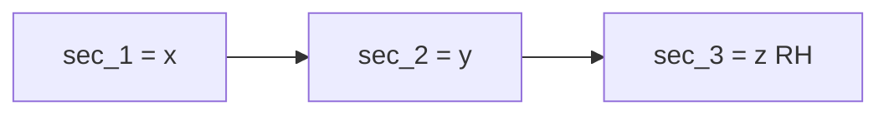

This is step 1 of [three](/docs/conventions/walkthrough). The section does not know about the ply.

- Geometry lives in `(sec_1, sec_2)` ≡ `(x, y)`.
- `sec_3` ≡ `z` is the right-hand normal, out of the page, and is the beam axis.
- Displacement at a point is `(ux, uy, uz)` along these axes.
- The solver still *names* these `x, y, z`.

## Element winding

Winding is numbered in this frame. Positive area is CCW when looking along `−sec_3` (from `+z`).

Details: [Element numbering](/docs/conventions/element-numbering).

1. gxbeam / meshio store a quad as BL → BR → TR → TL.
2. `mesh.from_gxbeam_vtu` flips any cell with negative shoelace.
3. It then permutes `[0, 3, 1, 2]` into dolfinx 0.10 tensor-product order: BL → TL → BR → TR.

Triangles are CCW from `+z` with no extra permutation.
