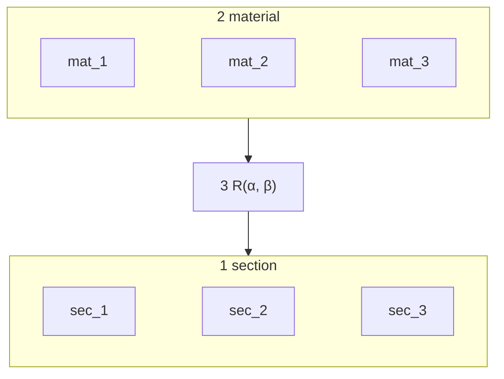

There are three things, in this order:

1. The **section frame** — where the mesh and the beam live.
2. The **material frame** — the ply card, before it is placed.
3. The **transform** `(α, β)` — the rotation that takes the material frame into the section frame.



Everything else (element winding, Voigt, ANBA) hangs off one of these three. Figures come from `material_axes` (`make docs-figures`).

## 1. Section frame

The mesh is a 2-D set in `(sec_1, sec_2)` ≡ `(x, y)`. `sec_3` ≡ `z` is the right-hand normal, out of the page, and is the beam axis. The solver still *names* these `x, y, z`.


Circled-dot = toward the viewer (`+sec_3`). Element winding (CCW from `+z`) belongs here: it is how the mesh is numbered in this frame, not a fourth frame. Details: [Section](/docs/conventions/section-frame).

## 2. Material frame

The ply card is written in `(mat_1, mat_2, mat_3)` and does not yet know about the section.

- `mat_1` — fibre
- `mat_2` — in-ply transverse
- `mat_3` — ply normal (through-thickness of the ply)


`OrthotropicMaterial.C_local()` is this frame. Details: [Material](/docs/conventions/material-card).

## 3. Transform — `R(α, β)`

The only map from frame 2 into frame 1 is

```
v_section = R(β, α) · v_mat
R(β, α)   = Rz(β) · Ry(α)
```

A material vector sees **`α` about global `y`, then `β` about global `z`**. `(0, 0)` is the identity.


| after `(0, 0)` | lands on |
|----------------|----------|
| `mat_1` fibre | `+sec_1` (`+x`) |
| `mat_2` in-ply | `+sec_2` (`+y`) |
| `mat_3` ply-normal | `+sec_3` (`+z`) |

`α` tilts the fibre out of the section toward the beam. `α = 90` puts it along `−z`. `β` is a right-hand rotation about `+sec_3`. At `α = 0`, `β` is the in-plane fibre angle from `+x`.


**`α` and `β` do not commute.** The product is `α` first (about `y`), then `β` (about `z`). They agree only when one angle is zero.


ANBA uses the same zero. Spanwise UD is `α = 90` / ANBA `fiber = 90`. The drop-in is [ANBA](/docs/solvers/anba).
