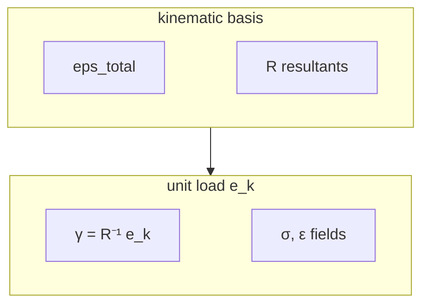

Two recoveries sit on a `SectionResult`.

- `recover_strains` — the six *kinematic basis* fields that built `R` and the energy matrix.
- `recover_unit_load_strains` — the engineering one: fields under applied `[Fx, Fy, Fz, Mx, My, Mz] = e_k`.

The amplitudes are `γ = R⁻¹ e_k`, not `K⁻¹ e_k`. The chain basis is not a set of generalised strains.



```python
from b3_secfem import recover_unit_load_strains, assemble_resultants_from_sigma

ul = recover_unit_load_strains(res)   # ul.sigma.shape == (6, n_cells, 6)
R_rec = [assemble_resultants_from_sigma(ul.sigma[k], res.mesh) for k in range(6)]
```

The integrated resultants of the six recovered `σ` fields reproduce `I` (`tests/test_recovery.py`). On an isotropic rectangle the shapes match beam theory: `σ_zz(Fz) = 1/A`, `σ_zz(Mx) = y/Ixx`, `σ_zz(My) = −x/Iyy`, mean `σ_xz(Fx) = 1/A`.

Compare fields only after the [same-problem map](/docs/solvers/adapters): same card, `β = plane`, `α = fiber`, **global** Voigt `(11,22,33,23,13,12)`. ANBA works on split triangles; the gate uses area-weighted mean and RMS (`tests/test_recovery_anba.py`).

- [Stress](/docs/recovery/stress) — six unit loads, ANBA `σ` overlay
- [Strain](/docs/recovery/strain) — same loads, Poisson `ε_xx`, ANBA `ε` overlay
- [NACA 0018](/docs/recovery/naca) — hollow station, centres on the compare
