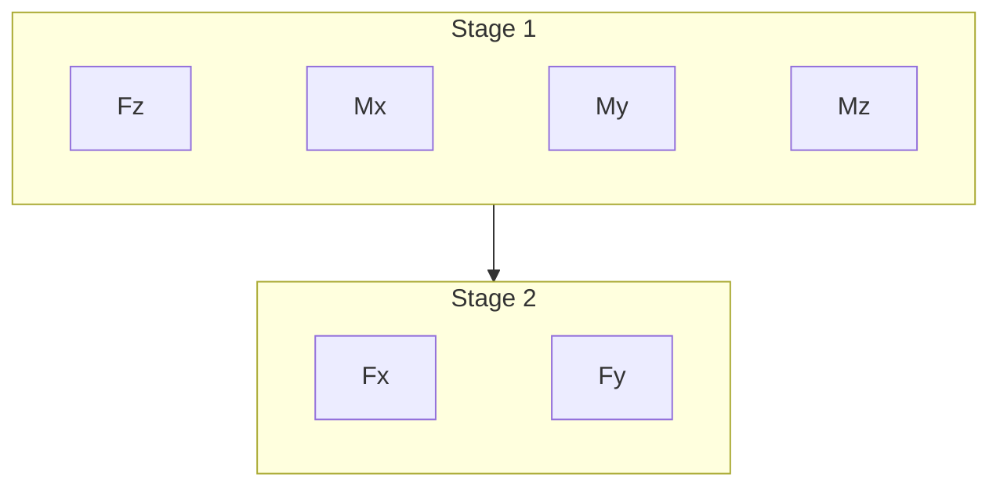

The beam is prismatic. Everything hard happens on one 2-D slice. For each of the six unit loads the solver finds a warping field on that slice, then turns the energy of that field into one column of `K`.

**Stage 1** — axial (`Fz`), the two bendings (`Mx`, `My`), and torsion (`Mz`). The assumed motion is a rigid stretch, bend, or twist of the section. The code only has to solve for the in-plane Poisson / torsion warping (`d₁`). On a decent mesh these match another Saint-Venant code when the material placement is the same.

**Stage 2** — transverse shear (`Fx`, `Fy`). That needs the *next* warping (`d₂`), built on top of the matching bending solution. This is the mode that feels a thin wall, a coarse through-thickness mesh, and a triangle split.

`K = R S⁻¹ Rᵀ` from the six strain fields. Compare in secfem order `[Fx, Fy, Fz, Mx, My, Mz]`. Applied unit-load recovery is `γ = R⁻¹ e_k` (not `K⁻¹`) — see [Recovery](/docs/recovery/how-it-works).

The card and `(β, α)` only set `C̄` on the slice. They are not the cell problem. When two solvers still disagree after the [same `C̄`](/docs/solvers/anba), the cause is Stage 1 vs Stage 2 (and the mesh) — see [Why they still differ](/docs/theory/residuals).
