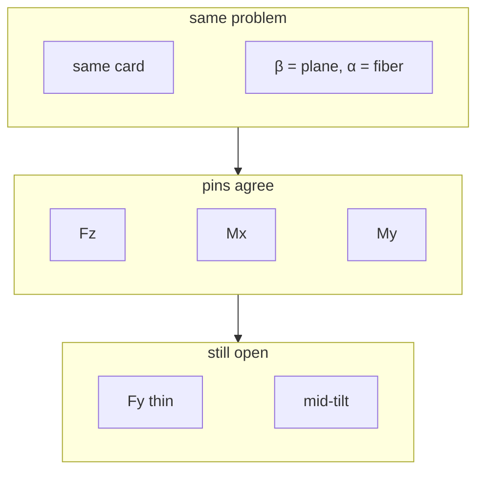

Short version: **the transform is not the leftover error.** Once secfem and ANBA are given the same card and the matching angles, axial and both bendings agree. What is left is how each code solves the slice, plus the mesh.

## How you know it is not the transform

The drop-in is [ANBA](/docs/solvers/anba): same card, `β = plane`, `α = fiber`. ANBA’s `T` equals secfem’s bond `T` at those angles (`tests/test_adapters.py`).

On the 0.04 × 0.01 rectangle with E1≠E2≠E3, the pin cases then match on the Stage-1 modes to 0.00 %:

| ANBA `(fiber, plane)` | what sits on `z` | Fz / Mx / My |
|---|---|---|
| `(0, 0)` | E3 | 0.00 % |
| `(90, 0)` | E1 | 0.00 % |
| `(0, 90)` | E3 | 0.00 % |

If the rotation or a 2↔3 were still wrong, those three would move first. They do not. Numbers: [known residuals](/docs/validation/known-residuals), script `examples/validation/same_problem.py`.

A 5 % gap between `K[Fz]` and the raw `C̄_{zz} A` is Poisson / warping relief (`d₁`). Both codes do it and they agree with each other. That is not a residual between solvers.

## Fy — thin-direction shear

`Fx` is shear along the long side of the rectangle. Both codes sit on `5/6 G_{xz} A`.

`Fy` is shear through the thin side (here only two quads thick). Secfem sits on `5/6 G_{yz} A` (within 1 %). ANBA is 13–27 % *below* that same number.

When the two shear moduli are equal (isotropic), Fy agrees to 0.4 %. The gap appears when `G_{yz} ≠ G_{xz}` on a thin mesh.

That is [Stage 2](/docs/theory/cell-problem) (`d₂`), not a card rewrite. ANBA also splits every quad into two triangles. Thin-direction shear is the mode that feels that. Do not treat ANBA’s lower Fy as the reference, and do not close it by swapping G13/G23.

## Mid-tilt — same `C̄`, different cell solve

At `(fiber, plane) = (45, 0)` the fibre sits at 45° in the `x`–`z` plane. `C̄` is already the same in both codes. Both then drop *far* below the naive `C̄_{zz} A` (around −60 %). That drop is real: a 45° fibre dumps a lot of the axial load into `xz` shear and warping.

They do not drop by the same amount (~9–12 % apart on Fz/Mx/My). The fibre is diagonal to the element edges; ANBA’s two-triangle split picks a diagonal. Compare 0° and 90° to check the convention. Do not edit `R` to shrink the mid-tilt gap.

## What not to do

- Change `R` or swap E2/E3 to chase Fy or mid-tilt.
- Read a NACA wrapped-skin case as a 2/3 test (per-cell angle map is a separate question).
- Call the pin-case Fz/Mx/My match “ANBA and secfem are the same solver”. They are the same *problem* on Stage 1. Stage 2 and mid-tilt remain formulation.
